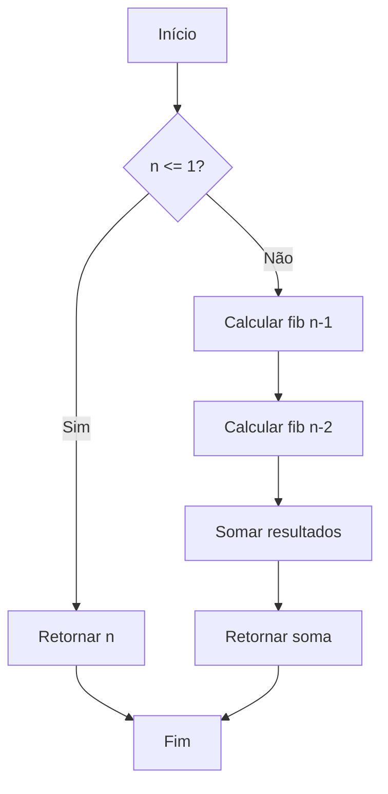
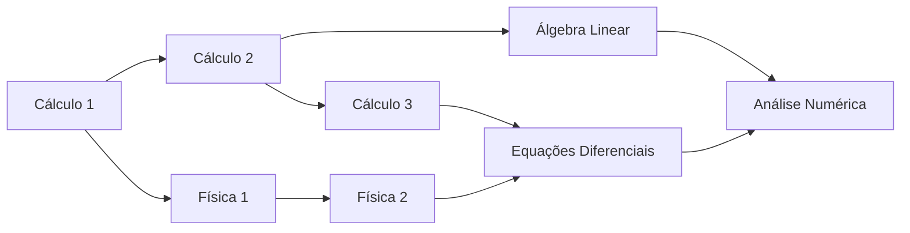
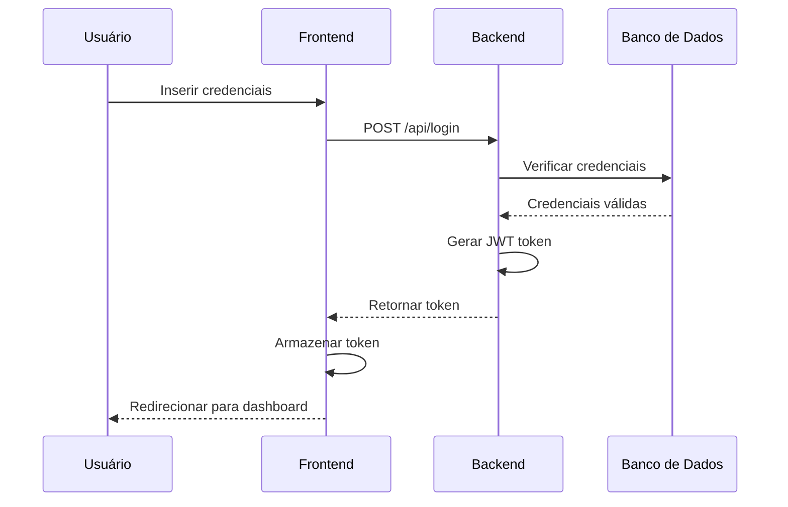
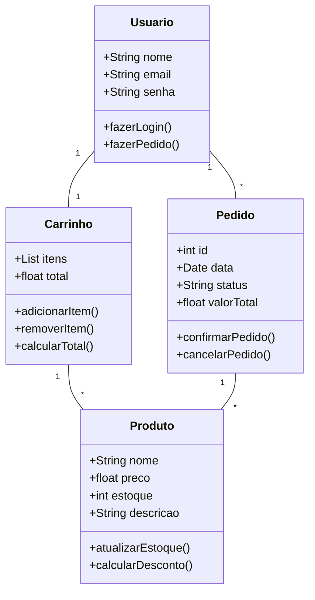
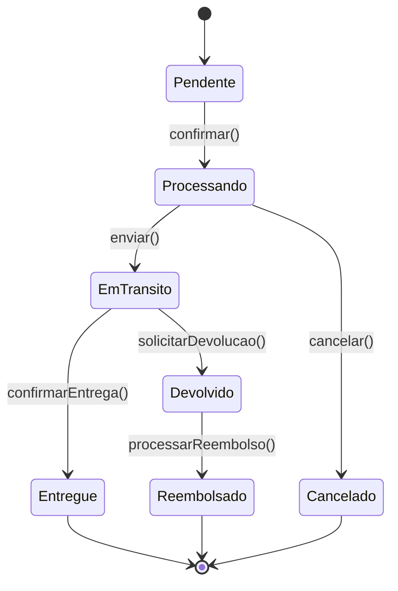
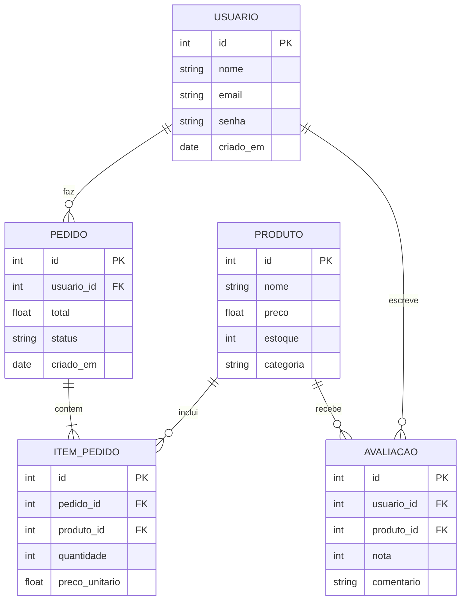
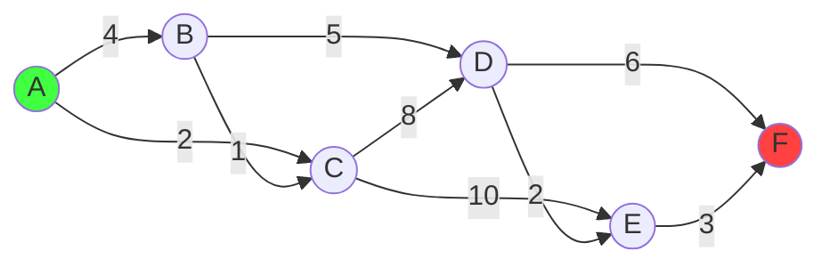

# Catálogo de Funcionalidades - KhromaAcademy

Este documento demonstra **TODAS** as funcionalidades disponíveis na plataforma KhromaAcademy.

---

## 1. Formatação de Texto Básica

### Headers de Todos os Níveis

# H1 - Título Principal
## H2 - Seção
### H3 - Subseção
#### H4 - Tópico
##### H5 - Subtópico
###### H6 - Menor Nível

### Ênfase em Texto

**Negrito**, *Itálico*, ***Negrito e Itálico***

~~Tachado~~, `código inline`

> Blockquote: Esta é uma citação importante
> que pode ter múltiplas linhas e é útil para
> destacar informações relevantes no contexto.

---

## 2. Listas

### Lista Não Ordenada

- Item 1
- Item 2
  - Subitem 2.1
  - Subitem 2.2
    - Subitem 2.2.1
    - Subitem 2.2.2
- Item 3
- Item 4

### Lista Ordenada

1. Primeiro passo
2. Segundo passo
3. Terceiro passo
   1. Subpasso 3.1
   2. Subpasso 3.2
4. Quarto passo

### Lista de Tarefas

- [x] Tarefa completada
- [x] Outra tarefa concluída
- [ ] Tarefa pendente
- [ ] Outra tarefa a fazer

---

## 3. Código com Syntax Highlighting

### Python

```python
def fibonacci(n):
    """
    Calcula o n-ésimo número de Fibonacci usando recursão.
    
    Args:
        n: O índice do número de Fibonacci desejado
        
    Returns:
        O n-ésimo número de Fibonacci
    """
    if n <= 1:
        return n
    return fibonacci(n-1) + fibonacci(n-2)

# Exemplo de uso com memoização
def fibonacci_memo(n, memo={}):
    if n in memo:
        return memo[n]
    if n <= 1:
        return n
    memo[n] = fibonacci_memo(n-1, memo) + fibonacci_memo(n-2, memo)
    return memo[n]

# Teste
for i in range(10):
    print(f"F({i}) = {fibonacci_memo(i)}")
```

### JavaScript

```javascript
class DataStructure {
  constructor(name) {
    this.name = name;
    this.data = [];
  }
  
  add(item) {
    this.data.push(item);
    this.sortData();
  }
  
  sortData() {
    this.data.sort((a, b) => a - b);
  }
  
  get length() {
    return this.data.length;
  }
  
  search(value) {
    return this.binarySearch(value, 0, this.data.length - 1);
  }
  
  binarySearch(value, left, right) {
    if (left > right) return -1;
    
    const mid = Math.floor((left + right) / 2);
    
    if (this.data[mid] === value) return mid;
    if (this.data[mid] > value) {
      return this.binarySearch(value, left, mid - 1);
    }
    return this.binarySearch(value, mid + 1, right);
  }
}

// Uso
const ds = new DataStructure('MinhaEstrutura');
ds.add(5);
ds.add(2);
ds.add(8);
console.log(ds.search(5)); // Output: índice do elemento
```

### TypeScript

```typescript
interface User {
  id: number;
  name: string;
  email: string;
  role: 'admin' | 'user' | 'guest';
}

class UserManager<T extends User> {
  private users: Map<number, T> = new Map();
  
  addUser(user: T): void {
    this.users.set(user.id, user);
  }
  
  getUser(id: number): T | undefined {
    return this.users.get(id);
  }
  
  filterByRole(role: T['role']): T[] {
    return Array.from(this.users.values())
      .filter(user => user.role === role);
  }
  
  getAllUsers(): T[] {
    return Array.from(this.users.values());
  }
}

// Uso
const manager = new UserManager<User>();
manager.addUser({
  id: 1,
  name: 'João Silva',
  email: 'joao@example.com',
  role: 'admin'
});
```

### SQL

```sql
-- Consulta complexa com múltiplas JOINs e subqueries
SELECT 
  u.name AS user_name,
  u.email,
  COUNT(DISTINCT o.id) AS total_orders,
  SUM(oi.quantity * oi.price) AS total_spent,
  AVG(oi.price) AS avg_item_price
FROM users u
LEFT JOIN orders o ON u.id = o.user_id
LEFT JOIN order_items oi ON o.id = oi.order_id
WHERE u.active = true
  AND o.created_at >= DATE_SUB(NOW(), INTERVAL 1 YEAR)
GROUP BY u.id, u.name, u.email
HAVING COUNT(o.id) > 5
ORDER BY total_spent DESC
LIMIT 100;

-- Criação de índice para otimização
CREATE INDEX idx_orders_user_date 
ON orders(user_id, created_at);

-- Procedure armazenado
DELIMITER $$
CREATE PROCEDURE GetTopCustomers(IN min_orders INT)
BEGIN
  SELECT u.name, COUNT(o.id) as order_count
  FROM users u
  INNER JOIN orders o ON u.id = o.user_id
  GROUP BY u.id
  HAVING order_count >= min_orders
  ORDER BY order_count DESC;
END$$
DELIMITER ;
```

### C++

```cpp
#include <iostream>
#include <vector>
#include <algorithm>

template<typename T>
class BinarySearchTree {
private:
    struct Node {
        T data;
        Node* left;
        Node* right;
        
        Node(T val) : data(val), left(nullptr), right(nullptr) {}
    };
    
    Node* root;
    
    Node* insert(Node* node, T value) {
        if (node == nullptr) {
            return new Node(value);
        }
        
        if (value < node->data) {
            node->left = insert(node->left, value);
        } else {
            node->right = insert(node->right, value);
        }
        
        return node;
    }
    
public:
    BinarySearchTree() : root(nullptr) {}
    
    void insert(T value) {
        root = insert(root, value);
    }
    
    bool search(T value) {
        Node* current = root;
        while (current != nullptr) {
            if (value == current->data) return true;
            current = (value < current->data) ? current->left : current->right;
        }
        return false;
    }
};
```

---

## 4. Equações Matemáticas (LaTeX)

### Equações Inline

A complexidade de tempo é $O(n \log n)$ e a de espaço é $O(n)$.

A fórmula quadrática é $x = \frac{-b \pm \sqrt{b^2-4ac}}{2a}$.

O teorema de Euler: $e^{i\pi} + 1 = 0$

### Equações em Bloco

Integral de Gauss:

$$
\int_{-\infty}^{\infty} e^{-x^2} dx = \sqrt{\pi}
$$

Soma dos primeiros n números naturais:

$$
\sum_{i=1}^{n} i = \frac{n(n+1)}{2}
$$

Produto de matrizes:

$$
\begin{bmatrix}
a & b \\
c & d
\end{bmatrix}
\begin{bmatrix}
x \\
y
\end{bmatrix}
=
\begin{bmatrix}
ax + by \\
cx + dy
\end{bmatrix}
$$

### Sistema de Equações

$$
\begin{cases}
x + y = 10 \\
2x - y = 5
\end{cases}
\Rightarrow
\begin{cases}
x = 5 \\
y = 5
\end{cases}
$$

### Análise Assintótica

$$
T(n) = \begin{cases}
1 & \text{se } n = 1 \\
2T(\frac{n}{2}) + n & \text{se } n > 1
\end{cases}
$$

Pelo teorema mestre: $T(n) = \Theta(n \log n)$

### Teoria dos Grafos

Número de caminhos em um grafo:

$$
P(v, w, k) = \sum_{u \in N(v)} P(u, w, k-1)
$$

Onde $N(v)$ são os vizinhos de $v$.

---

## 5. Tabelas

### Tabela de Complexidade de Algoritmos

| Algoritmo | Melhor Caso | Caso Médio | Pior Caso | Espaço |
|-----------|-------------|------------|-----------|--------|
| Bubble Sort | $O(n)$ | $O(n^2)$ | $O(n^2)$ | $O(1)$ |
| Quick Sort | $O(n \log n)$ | $O(n \log n)$ | $O(n^2)$ | $O(\log n)$ |
| Merge Sort | $O(n \log n)$ | $O(n \log n)$ | $O(n \log n)$ | $O(n)$ |
| Heap Sort | $O(n \log n)$ | $O(n \log n)$ | $O(n \log n)$ | $O(1)$ |
| Radix Sort | $O(nk)$ | $O(nk)$ | $O(nk)$ | $O(n+k)$ |

### Tabela com Alinhamento

| Esquerda | Centro | Direita |
|:---------|:------:|--------:|
| Texto | Texto | Texto |
| Alinhado à esquerda | Centralizado | Alinhado à direita |
| Item 1 | Item 2 | Item 3 |

### Tabela de Estruturas de Dados

| Estrutura | Acesso | Busca | Inserção | Remoção | Uso Principal |
|-----------|--------|-------|----------|---------|---------------|
| Array | $O(1)$ | $O(n)$ | $O(n)$ | $O(n)$ | Acesso por índice |
| Lista Ligada | $O(n)$ | $O(n)$ | $O(1)$ | $O(1)$ | Inserções frequentes |
| Hash Table | N/A | $O(1)$ | $O(1)$ | $O(1)$ | Busca rápida |
| Árvore Binária | $O(\log n)$ | $O(\log n)$ | $O(\log n)$ | $O(\log n)$ | Dados ordenados |
| Heap | $O(1)$ | $O(n)$ | $O(\log n)$ | $O(\log n)$ | Fila de prioridade |

---

## 6. Diagramas com Mermaid

### Fluxograma de Algoritmo



### Grafo de Dependências de Disciplinas



### Diagrama de Sequência - Autenticação



### Diagrama de Classes - Sistema de E-commerce



### Gráfico de Estado - Ciclo de Vida de Pedido



### Diagrama ER - Banco de Dados



---

## 7. Visualizações 3D Interativas

### Cubo 3D Rotativo

<div data-three='{"type":"cube","color":"#41ff41","animation":"rotate"}'></div>

*Arraste para rotacionar o cubo 3D acima. A visualização também anima automaticamente.*

### Esfera 3D com Animação de Bounce

<div data-three='{"type":"sphere","color":"#41ffff","animation":"bounce"}'></div>

*Esta esfera 3D salta verticalmente e pode ser rotacionada com o mouse.*

### Torus 3D com Animação de Pulse

<div data-three='{"type":"torus","color":"#ff41ff","animation":"pulse"}'></div>

*O torus 3D pulsa (aumenta e diminui) enquanto rotaciona suavemente.*

---

## 8. Quizzes Interativos

### Quiz 1: Complexidade de Algoritmos

<div data-quiz='{
  "id": "quiz1",
  "question": "Qual é a complexidade de tempo da busca binária em um array ordenado?",
  "options": [
    "O(n) - Linear",
    "O(log n) - Logarítmica",
    "O(n²) - Quadrática",
    "O(1) - Constante"
  ],
  "correctIndex": 1,
  "explanation": "A busca binária divide o espaço de busca pela metade a cada iteração, resultando em complexidade O(log n). Isso torna a busca binária muito eficiente para grandes conjuntos de dados ordenados."
}'></div>

### Quiz 2: Estruturas de Dados

<div data-quiz='{
  "id": "quiz2",
  "question": "Qual estrutura de dados usa o princípio LIFO (Last In, First Out)?",
  "options": [
    "Fila (Queue)",
    "Pilha (Stack)",
    "Árvore (Tree)",
    "Grafo (Graph)"
  ],
  "correctIndex": 1,
  "explanation": "Pilha (Stack) usa o princípio Last In, First Out - o último elemento inserido é o primeiro a sair. É amplamente usada em recursão, desfazer/refazer, e navegação de histórico."
}'></div>

### Quiz 3: Programação Orientada a Objetos

<div data-quiz='{
  "id": "quiz3",
  "question": "O que é polimorfismo em POO?",
  "options": [
    "Ocultar detalhes de implementação",
    "Criar múltiplas instâncias de uma classe",
    "Capacidade de um objeto assumir múltiplas formas",
    "Herdar características de uma classe pai"
  ],
  "correctIndex": 2,
  "explanation": "Polimorfismo é a capacidade de um objeto assumir múltiplas formas. Permite que objetos de diferentes classes sejam tratados como objetos de uma classe comum, facilitando a extensibilidade do código."
}'></div>

### Quiz 4: Banco de Dados

<div data-quiz='{
  "id": "quiz4",
  "question": "O que é uma chave estrangeira (Foreign Key)?",
  "options": [
    "Uma chave usada para criptografar dados",
    "Um campo que identifica unicamente cada registro",
    "Um campo que referencia a chave primária de outra tabela",
    "Uma chave usada para indexação rápida"
  ],
  "correctIndex": 2,
  "explanation": "Uma chave estrangeira (Foreign Key) é um campo que referencia a chave primária de outra tabela, estabelecendo um relacionamento entre as tabelas e mantendo a integridade referencial dos dados."
}'></div>

---

## 9. Exercícios Resolvidos Expandíveis

<details class="exercise-block">
<summary>🎯 Exercício 1: Implementar Busca Binária</summary>

### Problema

Implemente uma função de busca binária que encontre um elemento em um array ordenado.

### Requisitos

- **Input**: array ordenado e valor a buscar
- **Output**: índice do elemento ou -1 se não encontrado
- **Complexidade**: O(log n)
- **Não usar**: funções built-in de busca

### Solução em Python

```python
def busca_binaria(arr, x):
    """
    Busca binária iterativa
    
    Args:
        arr: Lista ordenada de elementos
        x: Elemento a ser buscado
    
    Returns:
        Índice do elemento ou -1 se não encontrado
    """
    esq, dir = 0, len(arr) - 1
    
    while esq <= dir:
        meio = (esq + dir) // 2
        
        # Elemento encontrado
        if arr[meio] == x:
            return meio
        
        # Se x é maior, ignora metade esquerda
        elif arr[meio] < x:
            esq = meio + 1
        
        # Se x é menor, ignora metade direita
        else:
            dir = meio - 1
    
    # Elemento não encontrado
    return -1

# Testes
arr = [1, 3, 5, 7, 9, 11, 13, 15, 17, 19]
print(f"Buscar 7: índice {busca_binaria(arr, 7)}")   # Output: 3
print(f"Buscar 4: índice {busca_binaria(arr, 4)}")   # Output: -1
print(f"Buscar 1: índice {busca_binaria(arr, 1)}")   # Output: 0
print(f"Buscar 19: índice {busca_binaria(arr, 19)}") # Output: 9
```

### Explicação Passo a Passo

1. **Inicialização**: Definimos ponteiros `esq` e `dir` para o início e fim do array
2. **Loop**: Enquanto há espaço de busca (`esq <= dir`)
3. **Meio**: Calculamos o índice do meio: `meio = (esq + dir) // 2`
4. **Comparação**: 
   - Se `arr[meio] == x`: encontramos, retornamos o índice
   - Se `arr[meio] < x`: elemento está na metade direita, atualizamos `esq`
   - Se `arr[meio] > x`: elemento está na metade esquerda, atualizamos `dir`
5. **Não encontrado**: Se saímos do loop, o elemento não existe, retornamos -1

### Análise de Complexidade

- **Tempo**: $O(\log n)$ - A cada iteração, dividimos o espaço de busca pela metade
- **Espaço**: $O(1)$ - Usamos apenas variáveis auxiliares (iterativa)

### Prova da Corretude

**Invariante de Loop**: A cada iteração, se x está no array, ele está entre os índices esq e dir.

**Base**: Inicialmente, esq = 0 e dir = n-1, então x pode estar em qualquer posição.

**Manutenção**: Se x > arr[meio], então x não pode estar em [esq, meio], logo movemos esq. O mesmo vale para o caso contrário.

**Término**: O loop termina quando esq > dir (elemento não encontrado) ou quando arr[meio] == x (encontrado).

</details>

<details class="exercise-block">
<summary>🎯 Exercício 2: Árvore Binária de Busca (BST)</summary>

### Problema

Implemente as operações básicas de uma BST (Binary Search Tree): inserção, busca e travessia in-order.

### Requisitos

- Implementar classe Node
- Implementar classe BST
- Operações: inserir, buscar, travessia in-order
- Manter propriedade BST: esquerda < raiz < direita

### Solução

```python
class No:
    """Nó de uma árvore binária"""
    def __init__(self, valor):
        self.valor = valor
        self.esq = None
        self.dir = None

class BST:
    """Árvore Binária de Busca"""
    def __init__(self):
        self.raiz = None
    
    def inserir(self, valor):
        """Insere um novo valor na BST"""
        if not self.raiz:
            self.raiz = No(valor)
        else:
            self._inserir_recursivo(self.raiz, valor)
    
    def _inserir_recursivo(self, no, valor):
        """Função auxiliar recursiva para inserção"""
        if valor < no.valor:
            if no.esq is None:
                no.esq = No(valor)
            else:
                self._inserir_recursivo(no.esq, valor)
        else:
            if no.dir is None:
                no.dir = No(valor)
            else:
                self._inserir_recursivo(no.dir, valor)
    
    def buscar(self, valor):
        """Busca um valor na BST"""
        return self._buscar_recursivo(self.raiz, valor)
    
    def _buscar_recursivo(self, no, valor):
        """Função auxiliar recursiva para busca"""
        # Caso base: nó vazio ou valor encontrado
        if no is None or no.valor == valor:
            return no
        
        # Valor está na subárvore esquerda
        if valor < no.valor:
            return self._buscar_recursivo(no.esq, valor)
        
        # Valor está na subárvore direita
        return self._buscar_recursivo(no.dir, valor)
    
    def inorder(self):
        """Travessia in-order (esquerda-raiz-direita)"""
        resultado = []
        self._inorder_recursivo(self.raiz, resultado)
        return resultado
    
    def _inorder_recursivo(self, no, resultado):
        """Função auxiliar recursiva para travessia in-order"""
        if no:
            self._inorder_recursivo(no.esq, resultado)
            resultado.append(no.valor)
            self._inorder_recursivo(no.dir, resultado)

# Exemplo de uso
bst = BST()
valores = [50, 30, 70, 20, 40, 60, 80]

for val in valores:
    bst.inserir(val)

print("Travessia in-order:", bst.inorder())
# Output: [20, 30, 40, 50, 60, 70, 80]

print("Buscar 40:", bst.buscar(40) is not None)  # True
print("Buscar 100:", bst.buscar(100) is not None)  # False
```

### Explicação da Invariante BST

Para todo nó da BST, a seguinte propriedade deve ser mantida:

- Todos os valores à **esquerda** são **menores**
- Todos os valores à **direita** são **maiores**

Matematicamente:

$$
\forall x \in \text{esquerda}(n): x < n.valor < y, \forall y \in \text{direita}(n)
$$

### Complexidade das Operações

| Operação | Melhor/Médio | Pior Caso |
|----------|--------------|-----------|
| Inserção | $O(\log n)$ | $O(n)$ |
| Busca | $O(\log n)$ | $O(n)$ |
| Travessia | $O(n)$ | $O(n)$ |

O pior caso $O(n)$ ocorre quando a árvore se degenera em uma lista ligada (todos os elementos inseridos em ordem crescente ou decrescente).

</details>

<details class="exercise-block">
<summary>🎯 Exercício 3: Algoritmo de Dijkstra</summary>

### Problema

Implemente o algoritmo de Dijkstra para encontrar o caminho mais curto entre dois vértices em um grafo ponderado.

### Requisitos

- Grafo representado por lista de adjacência
- Pesos não-negativos
- Retornar distâncias mínimas de um vértice fonte para todos os outros
- Retornar o caminho encontrado

### Solução

```python
import heapq
from collections import defaultdict

class Grafo:
    def __init__(self):
        self.adjacencias = defaultdict(list)
    
    def adicionar_aresta(self, u, v, peso):
        """Adiciona aresta direcionada de u para v com peso"""
        self.adjacencias[u].append((v, peso))
    
    def dijkstra(self, fonte):
        """
        Algoritmo de Dijkstra para caminho mais curto
        
        Args:
            fonte: Vértice de origem
        
        Returns:
            Dicionário com distâncias mínimas e predecessores
        """
        # Inicialização
        distancias = {fonte: 0}
        predecessores = {}
        visitados = set()
        
        # Fila de prioridade: (distância, vértice)
        pq = [(0, fonte)]
        
        while pq:
            dist_atual, u = heapq.heappop(pq)
            
            # Já visitamos com distância melhor
            if u in visitados:
                continue
            
            visitados.add(u)
            
            # Relaxamento das arestas
            for v, peso in self.adjacencias[u]:
                nova_dist = dist_atual + peso
                
                if v not in distancias or nova_dist < distancias[v]:
                    distancias[v] = nova_dist
                    predecessores[v] = u
                    heapq.heappush(pq, (nova_dist, v))
        
        return distancias, predecessores
    
    def reconstruir_caminho(self, predecessores, fonte, destino):
        """Reconstrói o caminho da fonte ao destino"""
        caminho = []
        atual = destino
        
        while atual != fonte:
            if atual not in predecessores:
                return None  # Não há caminho
            caminho.append(atual)
            atual = predecessores[atual]
        
        caminho.append(fonte)
        return caminho[::-1]

# Exemplo de uso
g = Grafo()
g.adicionar_aresta('A', 'B', 4)
g.adicionar_aresta('A', 'C', 2)
g.adicionar_aresta('B', 'C', 1)
g.adicionar_aresta('B', 'D', 5)
g.adicionar_aresta('C', 'D', 8)
g.adicionar_aresta('C', 'E', 10)
g.adicionar_aresta('D', 'E', 2)
g.adicionar_aresta('D', 'F', 6)
g.adicionar_aresta('E', 'F', 3)

distancias, predecessores = g.dijkstra('A')

print("Distâncias mínimas de A:")
for vertice, dist in sorted(distancias.items()):
    print(f"  A -> {vertice}: {dist}")

caminho = g.reconstruir_caminho(predecessores, 'A', 'F')
print(f"\nCaminho de A para F: {' -> '.join(caminho)}")
print(f"Distância total: {distancias['F']}")
```

### Como Funciona

1. **Inicialização**: Distância da fonte é 0, todas as outras infinito
2. **Fila de Prioridade**: Sempre processamos o vértice com menor distância conhecida
3. **Relaxamento**: Para cada vizinho, verificamos se há um caminho melhor
4. **Atualização**: Se encontramos caminho melhor, atualizamos distância e predecessor

### Complexidade

- **Tempo**: $O((V + E) \log V)$ com heap binário
  - $O(V)$ extrações da fila de prioridade
  - $O(E)$ operações de relaxamento
  - Cada operação na fila custa $O(\log V)$
- **Espaço**: $O(V)$ para armazenar distâncias e predecessores

### Visualização do Algoritmo



</details>

---

## 10. Callouts Especiais

> **💡 Dica: Performance**
>
> Use sempre a estrutura de dados mais simples que resolve o problema! Otimização prematura é a raiz de todos os males na programação.

> **⚠️ Atenção: Overflow**
>
> Cuidado com overflow em operações com inteiros grandes. Em Python não é problema, mas em C/C++/Java considere usar tipos de dados maiores (long, BigInteger).

> **✅ Best Practice: Validação**
>
> Sempre valide a entrada antes de processar. Nunca confie cegamente nos dados do usuário.

> **❌ Erro Comum: Recursão**
>
> Esquecer de verificar casos base em recursão leva a stack overflow. Sempre implemente o caso base primeiro!

> **📚 Referência: Literatura**
>
> Para mais detalhes sobre algoritmos e estruturas de dados, consulte:
> - "Introduction to Algorithms" (CLRS)
> - "The Art of Computer Programming" (Knuth)
> - "Algorithm Design Manual" (Skiena)

> **🔥 Performance Tip**
>
> Em loops aninhados, mova código invariante para fora do loop interno sempre que possível.

---

## 11. Links e Imagens

### Links Úteis

- [Documentação MDN Web](https://developer.mozilla.org)
- [Python Documentation](https://docs.python.org)
- [TypeScript Handbook](https://www.typescriptlang.org/docs/)
- [LeetCode para prática](https://leetcode.com)

### Imagem de Exemplo


---

## 12. Linha Horizontal

Use linhas horizontais para separar seções claramente:

---

## Conclusão

Este documento demonstra **TODAS** as capacidades da plataforma KhromaAcademy, desde formatação básica até visualizações 3D interativas e quizzes.

### ✅ Recursos Demonstrados:

1. ✅ Formatação Markdown completa (headers, listas, ênfase)
2. ✅ Syntax highlighting para múltiplas linguagens
3. ✅ Equações LaTeX (inline e bloco)
4. ✅ Tabelas com alinhamento e formatação
5. ✅ Diagramas Mermaid (fluxogramas, grafos, sequências, classes, estados, ER)
6. ✅ Visualizações 3D interativas com Three.js
7. ✅ Quizzes interativos com feedback
8. ✅ Exercícios expandíveis com soluções detalhadas
9. ✅ Callouts especiais para destacar informações
10. ✅ Links e imagens
11. ✅ Código com comentários e documentação

### 🎓 Pronto para Aprender!

Esta plataforma está equipada com todas as ferramentas necessárias para uma experiência de aprendizado completa e interativa em Ciência da Computação.

**Explore, pratique e domine os conceitos!** 🚀

